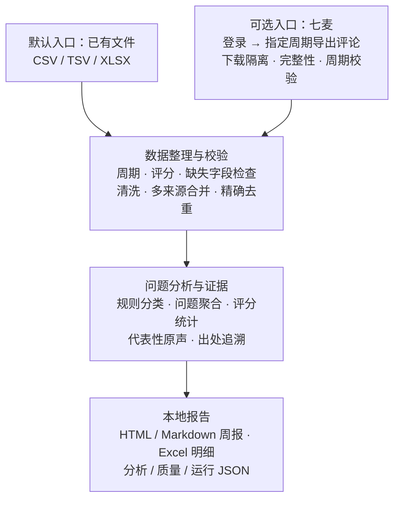
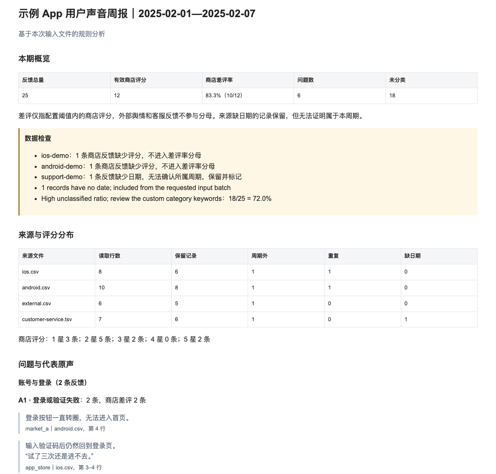

# App User Voice

App User Voice 是一个面向产品、运营和开发团队的 App 用户声音周报工具。它把应用商店评论、社区反馈和客服记录整理成包含问题统计、代表原声和出处的本地报告，减少每周手工汇总与核对的重复工作。

这个项目来自我持续使用的周报工作流。我把原先固定的 App、输入文件、分析规则和输出位置改为配置，保留清洗、分析与原声核对逻辑，整理成其他人也能运行和调整的工具。

## 拿到数据后，它会做什么

1. **整理数据**：校验周期，检查评分与缺失字段，清洗、合并多来源反馈并精确去重。
2. **分析问题**：按配置规则分类、聚合问题，统计有效评分，保留未分类反馈。
3. **保留证据**：选择代表性用户原声，记录文件、Sheet 和行号，重复反馈保留全部出处。
4. **生成周报**：输出 HTML、Markdown、Excel 明细，以及分析、质量检查和运行 JSON。

## 两种入口，一条完整流程

- **已有数据文件（默认）**：直接导入 CSV、TSV 或 XLSX，按配置的周期和规则生成报告。
- **还没有商店评论文件（可选）**：启用七麦入口，在浏览器登录后按指定周期导出评论，校验下载文件，再送入统一流程。

两种入口可以单独使用，也可以合并使用。七麦负责获取评论数据；后面的清洗、分析和报告生成与本地文件共用一套流程。



## 报告预览

下面是仓库合成数据实际生成的 HTML 报告：先看反馈与评分概览，再看问题和代表原声。



示例四来源共 31 行，去掉 2 条精确重复和 4 条周期外记录后保留 25 条，形成 6 个问题；其中 1 条缺日期，会明确告警。有效商店评分 12 条，差评 10 条，差评率 83.3%。这些数字只说明 Demo 的处理结果。

[查看原声与出处核对示例](docs/USAGE.md#读懂报告)，或按下面的命令生成完整报告。所有示例反馈都是合成数据。

## 快速运行 Demo

需要 Python 3.10 或更新版本。下载仓库后，在项目根目录运行：

```bash
git clone https://github.com/ask6688/app-user-voice.git
cd app-user-voice
python3 -m venv .venv
source .venv/bin/activate
python -m pip install -r requirements.txt
python -m feedback_pipeline --config config.example.yaml
```

Windows PowerShell 用 `.venv\Scripts\Activate.ps1` 激活环境；命令提示符用 `.venv\Scripts\activate.bat`。其余步骤相同。

本地流程不需要 Node、钉钉或大模型账号。命令会打印本次输出目录 `outputs/<起止日期>/<本次运行时间>/`：

| 文件 | 用途 |
| --- | --- |
| `report.html` / `report.md` | 阅读与分享周报 |
| `details.xlsx` | 统计、问题、全量反馈、出处、排除记录与告警 |
| `analysis.json` / `quality.json` / `run.json` | 核对分析结果、输入版本、质量检查与完成状态 |

每次运行生成独立目录，不覆盖之前的报告，不修改输入文件。

## 换成自己的 App 和数据

```bash
cp config.example.yaml config.local.yaml
# 编辑 config.local.yaml，再运行：
python -m feedback_pipeline --config config.local.yaml --dry-run
python -m feedback_pipeline --config config.local.yaml
```

填写 App 名称、时间范围、输入文件、分析规则和输出位置即可。**请把示例来源全部替换为自己的文件**，建议放在已忽略的 `data/input/` 目录；路径相对于配置文件所在目录。运行后，工具会核对周期与字段、合并去重，再按你的规则整理问题和原声，生成本地周报。

常见中文表头会自动识别，其他表头用 `columns` 映射。换 App 和分析规则不需要修改 Python。`--dry-run` 检查配置并打印计划，不读取输入数据或启动浏览器。

[配置、字段映射和统计口径](docs/USAGE.md) · [字段映射示例](config/mapping.example.yaml) · [通用规则](config/rules.generic.yaml)

## 两种分析方式

无论使用文件导入还是七麦采集，都可以选择以下分析方式：

| 模式 | 适用场景 | 当前做法 |
| --- | --- | --- |
| `generic`（默认） | 根据自己产品的反馈主题调整规则 | YAML 定义类别、关键词、必要条件与排除条件，可多标签匹配 |
| `media`（可选） | 媒体与下载类产品 | 保留播放、浏览与搜索、会员、下载、新版本五模块的片段路由、相似度聚合和场景核对 |

两种方式都选取输入中的原声，不调用大模型。`media` 的一级模块固定，配置可调整评分、引文、告警阈值及场景核对开关。规则没有覆盖的反馈仍会保留，便于复核和继续完善规则。

```bash
python -m feedback_pipeline --config config/media.example.yaml
```

## 可选七麦采集

七麦入口用于按指定周期获取应用商店评论，减少逐次打开页面、导出和下载的手工操作。导出文件经过下载隔离、完整性和周期检查后，会自动与已配置的本地文件一起进入分析流程。只有启用采集时才需要 Node.js 20+、Playwright 和平台账户；[安装与配置说明](docs/USAGE.md#可选七麦采集)。

**状态：已通过本地模拟回归，公开版尚未完成新的真实线上采集验收。** 已启用的七麦来源采集失败时，本次停止生成完整周报。

## 当前边界与后续

当前一次报告对应一个 App；规则需结合自己的反馈调整，媒体模式的五个模块固定。默认遮盖正文中的手机号和邮箱形式内容、隐藏原帖 URL，姓名与上下文身份仍需人工复核。统计、去重限制与隐私口径见 [使用说明](docs/USAGE.md#统计与质量口径)。

DOCX、PDF、钉钉、多 App、趋势分析、定时调度和 Web 界面留在 [Roadmap](docs/PUBLIC_CANDIDATE.md#后续-roadmap)，不属于当前已实现能力。

## 开发与公开范围

```bash
python -m unittest discover -s tests -v
python scripts/check_public_candidate.py .
```

运行数据、报告、登录状态和本地配置不属于公开文件；明确提交范围见 [PUBLIC_FILES.txt](PUBLIC_FILES.txt)。项目采用 [MIT License](LICENSE)；[公开范围与迁移说明](docs/PUBLIC_CANDIDATE.md)。
