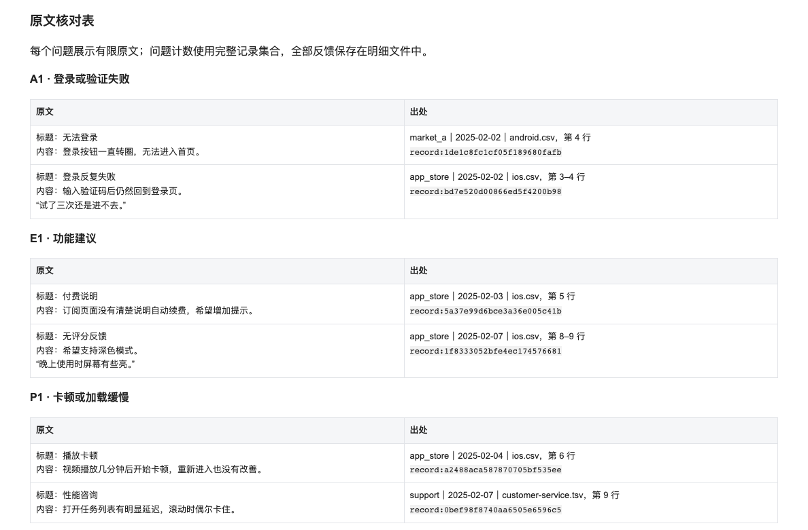

# 使用与核对

本页补充 README 的配置、统计口径和可选采集细节。默认导入已有文件，也可以开启七麦获取评论；两种入口可以合并使用，输入应属于同一个 App，后续共用清洗、分析和报告流程。建议先运行根目录 Demo，再替换数据。

## 配置自己的输入

复制 `config.example.yaml` 为 `config.local.yaml`，替换其中全部演示文件。建议保持配置在项目根目录，把私有输入放到 `data/input/`；此目录和 `*.local.yaml` 均不提交。

以下是需要编辑的配置片段，保留示例中的其他设置：

```yaml
app:
  name: 我的 App
  company: ""          # 可选，仅影响报告展示
period:
  start: "2025-02-01"
  end: "2025-02-07"
sources:
  files:
    - id: my-reviews
      path: data/input/reviews.csv
      kind: android
      platform: 我的应用商店
      columns:
        date: 评论日期
        rating: 评分
        text: 评论正文
analysis:
  mode: generic
  rules_file: config/rules.generic.yaml
output:
  directory: outputs
  formats: [html, markdown, xlsx]
```

`app.name` 是报告对象名称，不会从混合文件里自动筛选 App。CSV、TSV、XLSX 都可以导入，多个文件组成一份报告。设置来源的 `enabled: false` 可关闭它。

规则路径、文件路径和输出路径均相对于配置文件所在目录。自定义规则可复制为 `config/rules.local.yaml`，再修改 `analysis.rules_file`；本地规则不提交。

### 输入字段

| 统一字段 | 用途与缺失处理 |
| --- | --- |
| `text` | 正文列必须存在；完全没有标题或正文的行跳过 |
| `title` | 可选标题 |
| `source` | `ios/android/external/customer_service`；缺省使用来源配置的 `kind` |
| `platform` | 渠道名；缺省使用来源配置的 `platform` 或来源类型 |
| `date` | 含年份的日期；缺失保留并告警，非法日期报错 |
| `rating` | 商店反馈的 1–5 星整数；缺失告警，非法评分报错 |
| `review_id` | 可选稳定评论 ID，用于区分同内容记录 |
| `period_start/period_end` | 可选反馈日期范围，必须完整落在报告周期内 |
| `url` | 可选来源链接，默认不输出 |

常见中文表头可自动识别；其他表头使用 `columns` 映射。完整映射示例：

```bash
python -m feedback_pipeline --config config/mapping.example.yaml
```

XLSX 默认读全部 Sheet，可用 `sheets` 指定。`header_row` 默认为 1；设置 `auto` 会在前 30 行寻找正文表头，也可填写明确行号。当前不读旧式 `.xls`。

CSV 自动尝试 UTF-8 和 GB18030，必要时指定 `encoding`；TSV 默认用 Tab 分隔。列数不一致、无正文表头或非法日期/评分会明确失败。

### 时间范围

- `period.start/end` 同时填写时使用明确周期，格式为 `YYYY-MM-DD`。
- 两者设为 `null` 时，按 `last_complete_days` 和 `timezone` 计算最近完整自然日，默认 7 天，不含执行当天。
- 命令行 `--start-date/--end-date` 同时提供时优先于配置。

`--dry-run` 检查配置、规则文件和采集计划，不检查输入文件内容，也不生成报告。

## 分析规则

`generic` 使用 `config/rules.generic.yaml`。类别可设 `requires_any`、`strong_keywords/strong_only`，问题可设 `keywords`、`require_any` 和 `exclude`。没有匹配的反馈仍进入未分类内容；一个反馈可匹配多个主题。

`media` 保留五个媒体与下载模块的动态聚合。`config/rules.media.yaml` 可设置差评阈值、引文数量与长度、未分类比例告警，并通过 `media_report_quality` 开关场景核对；不支持用 YAML 任意改写五个模块。

修改规则后，先对照原声和未分类反馈复核。示例规则说明配置方法，不承诺适合所有产品。

## 读懂报告

HTML 和 Markdown 共用同一份报告计划，展示概览、质量告警、问题、代表原声、原文核对和未分类内容；HTML 另外展示来源统计与星级分布。问题计数来自完整记录集合，代表原声与核对表的展示上限不会截断统计。

下面是合成数据报告中的原文核对表，展示渠道、日期、正文、文件行号与记录 ID：



`details.xlsx` 包含：

| Sheet | 内容 |
| --- | --- |
| `Summary` | 概览和评分统计 |
| `Issues` | 问题、计数与代表原声 |
| `Records` | 全量保留记录及出处 |
| `Sources` | 源文件版本与质量统计 |
| `Excluded` | 去重、周期外等排除记录的位置与原因 |
| `Warnings` | 质量告警 |

`analysis.json` 保留完整问题记录集合，`quality.json` 保留输入哈希和质量统计，`run.json` 保留本次完成状态与输出文件哈希。报告按运行生成新目录，不更新旧有长期工作簿。

## 统计与质量口径

- 差评阈值默认 3 星；差评率分母仅为有效 1–5 星的商店评分。外部反馈、客服和缺评分记录不参与该分母；没有有效评分时显示不适用。
- 周期外记录排除并标明出处。缺日期记录保留并告警，不能视作已验证属于周期。
- 去重按来源类型、渠道、日期/范围、评分、标题、正文及可选评论 ID 精确比较。跨渠道同文本保留，重复记录保留全部出处。
- 缺少评论 ID 时，同渠道、同日、相同内容的不同作者可能被合并；当前没有模糊去重。
- CSV 记录实际起止行，Excel 记录文件、Sheet 和行号，源文件 SHA256 用于核对输入版本。主题计数是多标签口径，不可直接相加作为总反馈量。
- 客服正文以用户/客服/系统角色标签开头时，提取有效用户片段用于分析；完整对话只在内存中用于精确去重，不复制进报告。此类原声来自标准化用户文本，仍可回到原文件核对。
- 默认遮盖输出正文的手机号和邮箱形式内容，默认隐藏来源 URL。文件名、Sheet 名、App/渠道标签、姓名和上下文身份仍可能含信息，分享报告前请复核；原始输入不被改写。

## 可选七麦采集

七麦负责获取应用商店评论：浏览器登录 → 指定周期导出 → 下载隔离与完整性、周期校验 → 作为文件输入接入统一分析流程。配置中的本地文件可以保留并一同分析，也可以清空，只分析七麦导出；`generic/media` 的选择与数据入口无关。

此能力已通过本地模拟回归，公开版尚未重新完成真实线上验收。依赖平台账户权限、登录状态与页面结构；无需采集时，只用文件入口即可。

需要 Node.js 20+，在项目根目录安装：

```bash
npm ci
PLAYWRIGHT_BROWSERS_PATH=.playwright npx playwright install chromium
```

Windows PowerShell 先运行 `$env:PLAYWRIGHT_BROWSERS_PATH='.playwright'`，再运行 `npx playwright install chromium`。

在根目录的 `config.local.yaml` 中，替换演示输入和时间范围。例如只采集 iOS 时：

```yaml
app:
  name: 我的 App
  ios_app_id: "YOUR_IOS_APP_ID"
sources:
  files: []            # 清空演示来源，避免把合成数据混入自己的报告
  qimai:
    enabled: true
    platforms: [ios]
    country: cn
```

这是配置片段，仍需保留 `period/analysis/output` 等设置。Android 需在 `sources.qimai.android_app_id` 填七麦内部 ID，不是 Android 包名；`android_channels` 可选 `oppo/vivo/huawei/xiaomi/meizu`，也可提供 `key/name/marketCode` 对象。

首次运行在打开的专用浏览器窗口完成登录；验证码、滑块等需在窗口中人工处理。可选 `QIMAI_USERNAME/QIMAI_PASSWORD` 环境变量提供账户；`.env.example` 仅说明变量名，程序不自动加载 `.env`。

采集保留日期回读、GUID 下载隔离、完成状态、ZIP/CSV 完整性及周期检查。任一启用来源失败，本次不生成完整周报。

浏览器下载放在 `.playwright/`，专用登录 Profile 在 `.browser/`，原始导出在 `data/raw/`，诊断在 `outputs/qimai/`，这些均不提交。程序断开连接后保留专用登录浏览器，不自动关闭它。

## 语义快照维护

[semantic_definitions.json](../feedback_pipeline/semantic_definitions.json) 保存版本化的公共概念与同义表达快照，随仓库发布，单独 clone 即可运行。它不决定最终分类，也不把 `media` 变为任意模块的通用引擎：当前仍使用上述五个模块。三组 alias 分别表示播放失败、下载失败和搜索失败，仍在本项目原有的媒体聚类阶段使用，替换顺序和路由之后的调用位置保留。快照不会自动接入另一个项目的分类、原文或去重键；各消费者继续保留自己的上下文规则。概念中出现广告、风控等名称，不代表本项目新增了这些模块。

需要同步到另一个项目时，显式指定快照目标；默认只比较字节，发现差异返回非零状态，只有加 `--write` 才写入：

```bash
python scripts/sync_semantics.py --target ../app-feedback-trends/trendlib/semantic_definitions.json --cases-target ../app-feedback-trends/tests/semantic_cases.json
# 核对差异后，再显式同步：
python scripts/sync_semantics.py --target ../app-feedback-trends/trendlib/semantic_definitions.json --cases-target ../app-feedback-trends/tests/semantic_cases.json --write
```

同步命令打印版本和 SHA-256；运行分析时只读取各仓库自己的快照，不跨仓库导入或联网同步。同步定义不等于接受分类变化，更新后仍需运行各项目的兼容性测试。

Trend 当前保留同一份定义快照及其版本，不把 alias 全局应用到分类输入；默认 preset 仍使用自己的内置规则。共同案例分别声明 `topic_matches`、`route_modules` 和 `issue_modules`，各项目只验证自己的预期。

兼容性测试会对照提交 `03d22063f0ef72ff31eb31e0cca3829052a5f810` 的旧实现；普通完整 clone 可运行该对照，浅克隆缺少此提交时会明确跳过历史对照，仍运行当前规则案例。

## 本地检查

```bash
python -m unittest discover -s tests -v
python scripts/check_public_candidate.py .
```

安装可选浏览器后，可运行本地模拟采集回归：

```bash
PLAYWRIGHT_BROWSERS_PATH=.playwright PYTHON=.venv/bin/python npm run test:qimai
```

Windows PowerShell 用 `$env:PYTHON='.venv/Scripts/python.exe'` 设置解释器后运行 `npm run test:qimai`。测试使用合成页面、数据和临时目录，不访问真实平台。
